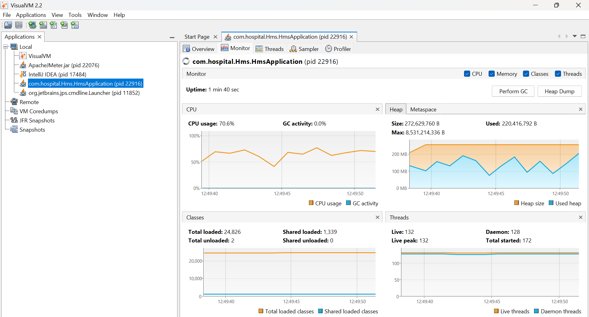
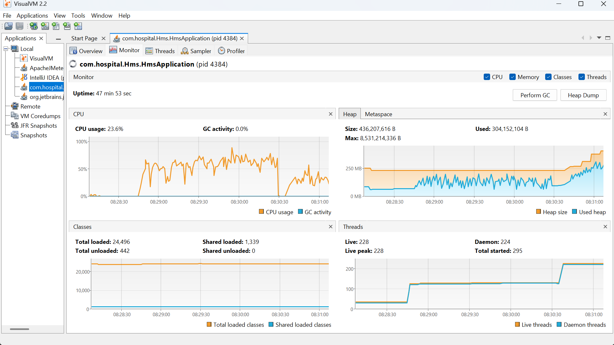
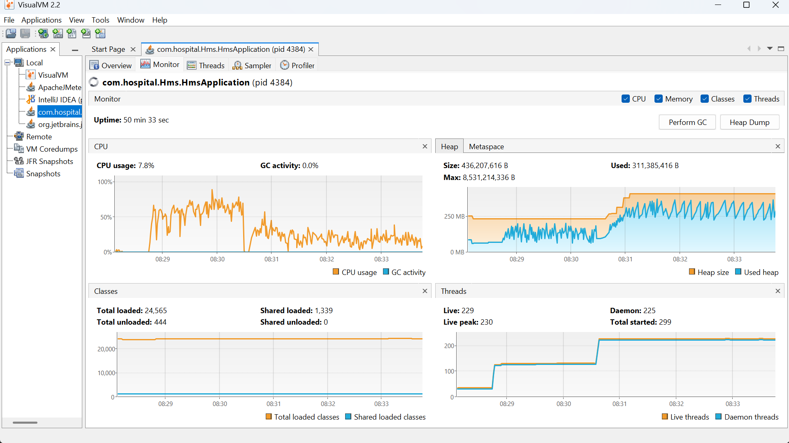
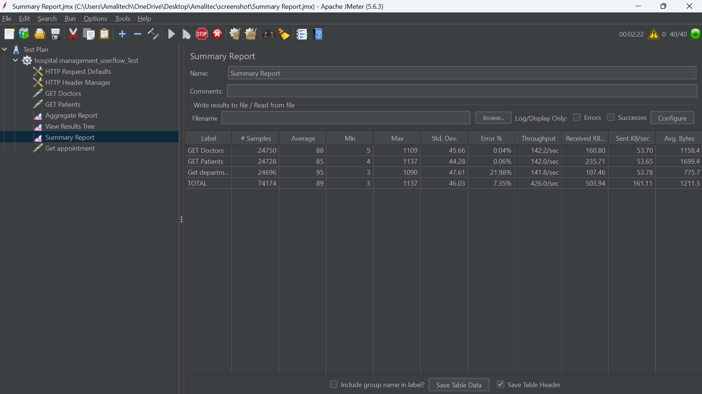
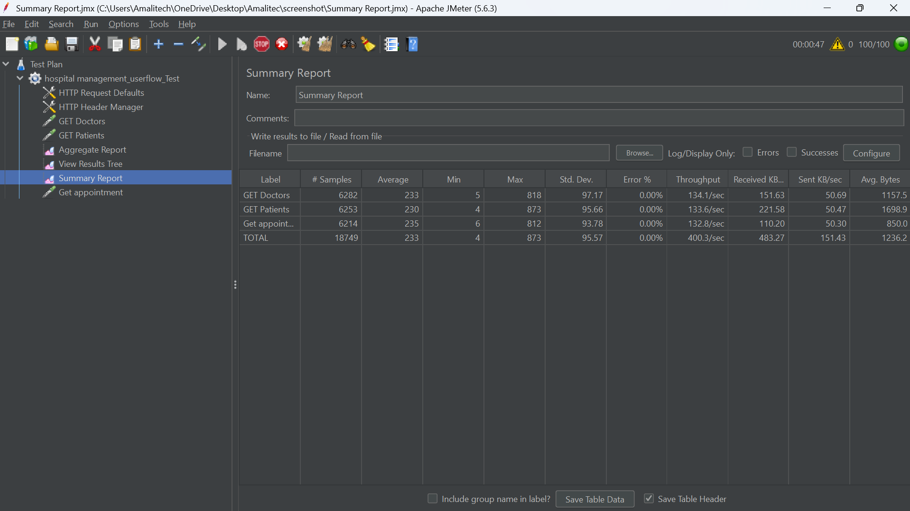
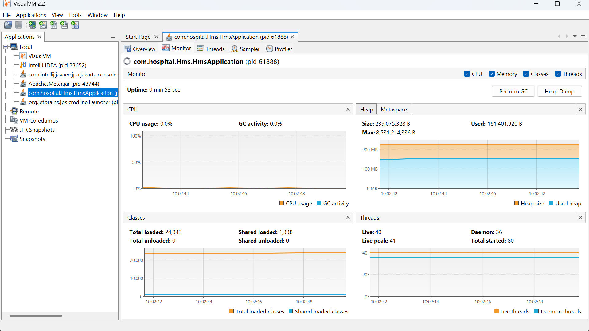
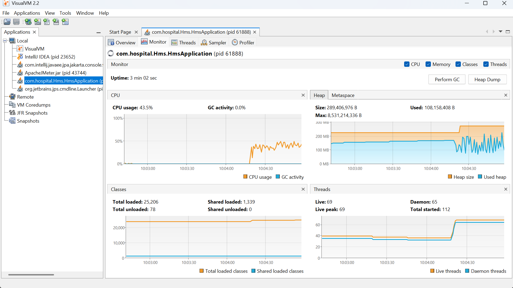

# Performance Optimization Lab Report
## Spring Boot + PostgreSQL Hospital Management System

**Student Project:** Hospital Healthcare Management System  
**Tools Used:** Apache JMeter 5.6.3, VisualVM 2.2  
**Date:** February 18, 2026

---

## 1. Introduction
This lab evaluates and improves the runtime performance of a Spring Boot + PostgreSQL Hospital Management System under concurrent API load. The main goal was to identify bottlenecks that caused high latency and request failures, apply targeted optimizations, and verify improvements using load testing and JVM profiling.

## 2. Objectives
1. Measure baseline API performance under concurrent traffic.
2. Identify bottlenecks from JVM behavior (CPU, heap, threads, GC).
3. Apply backend and database optimizations.
4. Re-test and compare before vs after results.

## 3. Tools and Test Setup
| Component | Details |
|---|---|
| Backend | Spring Boot (`com.hospital.Hms.HmsApplication`) |
| Database | PostgreSQL |
| Load tool | Apache JMeter 5.6.3 |
| JVM profiler | VisualVM 2.2 |
| Endpoints tested | `GET /doctors`, `GET /patients`, `GET /appointment` |
| Load profile | Concurrent user workflow with repeated GET requests |

## 4. Test Scenarios
The JMeter test plan executed a hospital user workflow:
1. Fetch doctors list
2. Fetch patients list
3. Fetch appointments

This reflects common read-heavy usage in hospital front-desk and dashboard views.

---

## 5. Baseline Results (Before Optimization)
### 5.1 JMeter Aggregate Report (Before)
| Metric | Value |
|---|---|
| Total Samples | 859,435 |
| Average Response Time | 1,729 ms |
| Median | 1,622 ms |
| 90th Percentile | 2,685 ms |
| 95th Percentile | 3,052 ms |
| 99th Percentile | 3,709 ms |
| Maximum | 6,351 ms |
| Error Rate | 72.17% |
| Throughput | 252.3 req/sec |

### 5.2 Baseline Interpretation
Baseline performance was unstable. Response times were high, tail latency was severe (P95/P99 > 3 seconds), and error rate exceeded 70%, which is unacceptable for a healthcare system.

### 5.3 Baseline Evidence (JMeter)

---

## 6. Optimization Changes Implemented
The following optimizations were added to improve query efficiency and response speed.

### 6.1 Implemented Optimization Summary
| Optimization | What was added | Performance effect |
|---|---|---|
| Database Indexes | Indexes on frequently queried/joined columns | Faster lookup and reduced DB scan time |
| Pagination | Paginated API/data retrieval for large result sets | Lower response payload and improved latency |
| Caching | Caching for frequently requested data | Reduced repeated DB access and better throughput |
| `@EntityGraph` | Controlled eager loading for required relationships | Fewer extra queries and reduced lazy-loading overhead |

### 6.2 EntityGraph-Specific Changes
- Added `@EntityGraph` to `AppointmentRepository.findById(Long id)`.
- Updated `PrescriptionRepository.findByAppointment_AppointmentId(Long appointmentId)` to preload:
  - `appointment.doctor`
  - `appointment.doctor.user`
  - `appointment.patient`

### 6.3 Optimization Evidence

---

## 7. Improved Results (After Optimization)
### 7.1 JMeter Summary Report (After)
| Metric | Value |
|---|---|
| Total Samples | 18,749 |
| Average Response Time | 233 ms |
| Minimum | 4 ms |
| Maximum | 873 ms |
| Error Rate | 0.00% |
| Throughput | 400.3 req/sec |

### 7.2 Endpoint-Level Results (After)
| Endpoint | Samples | Avg (ms) | Throughput (req/sec) | Error % |
|---|---:|---:|---:|---:|
| GET Doctors | 6,282 | 233 | 134.1 | 0.00 |
| GET Patients | 6,253 | 230 | 133.6 | 0.00 |
| GET appointment | 6,214 | 235 | 132.8 | 0.00 |

### 7.3 Before vs After Comparison
| Metric | Before | After | Improvement |
|---|---:|---:|---:|
| Average Response Time | 1,729 ms | 233 ms | **86.5% lower** |
| Maximum Response Time | 6,351 ms | 873 ms | **86.3% lower** |
| Error Rate | 72.17% | 0.00% | **Failures eliminated** |
| Throughput | 252.3 req/sec | 400.3 req/sec | **58.7% higher** |

---

## 8. VisualVM Analysis
### 8.1 CPU
- Baseline run showed high CPU pressure (around 70.6%).
- Optimized runs showed lower and more stable CPU levels (about 43.5%, then 7.8-23.6% in sustained periods).

### 8.2 Heap Memory
- Heap usage remained controlled (~108 MB to ~311 MB across runs).
- No continuous upward trend suggesting memory leak was observed.

### 8.3 Threads
- Live thread counts varied by test phase (~69, ~132, and ~228-230 in higher-concurrency windows).
- Thread growth matched load phases and remained stable during the optimized runs.

### 8.4 Garbage Collection
- VisualVM monitor showed 0.0% GC activity in captured windows.
- GC was not a visible bottleneck during these tests.

### 8.5 VisualVM Evidence

---

## 9. Conclusion
The optimization process significantly improved both performance and reliability of the hospital management system.

Key outcomes:
- Much faster API responses
- Zero request errors in the optimized test run
- Higher throughput under concurrent load
- Stable JVM behavior in CPU, memory, and GC observations

These results confirm that combining **indexes, pagination, caching, and EntityGraph** produces strong practical gains in Spring Boot healthcare applications.

## 10. Recommendations
1. Run 30-60 minute soak tests to validate long-term stability.
2. Include P90/P95/P99 values in every post-change report for tail-latency tracking.
3. Monitor cache hit ratio and tune cache TTL for best balance of freshness and performance.
4. Review PostgreSQL index usage periodically to remove unused indexes and keep write performance healthy.
5. Add regression performance checks to CI for critical endpoints.

---

## Appendix: Additional Evidence

